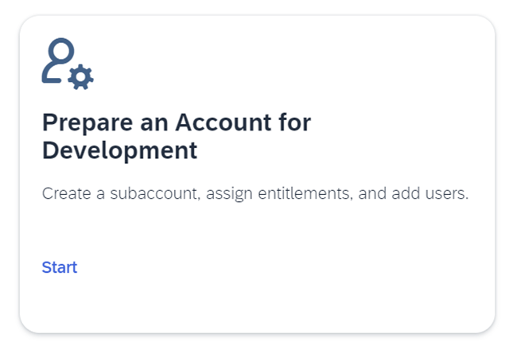
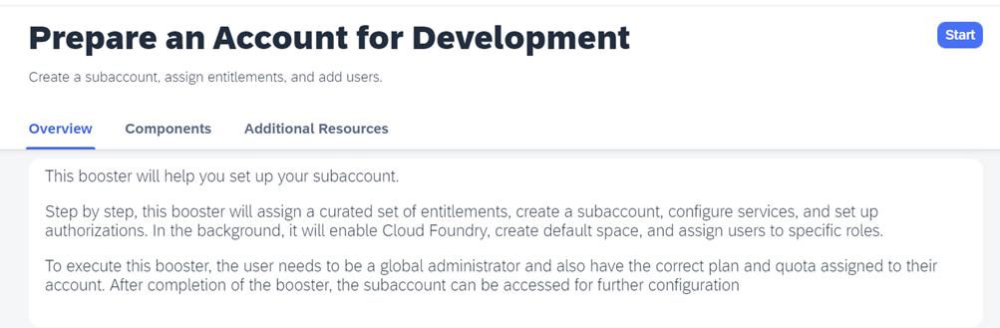
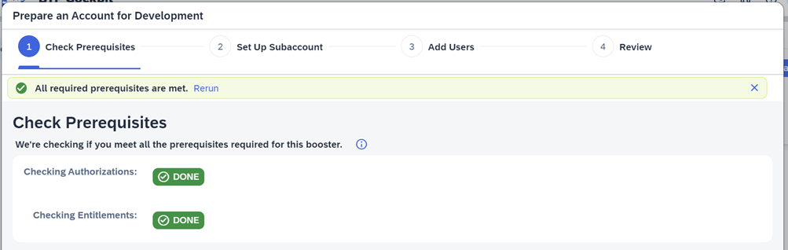
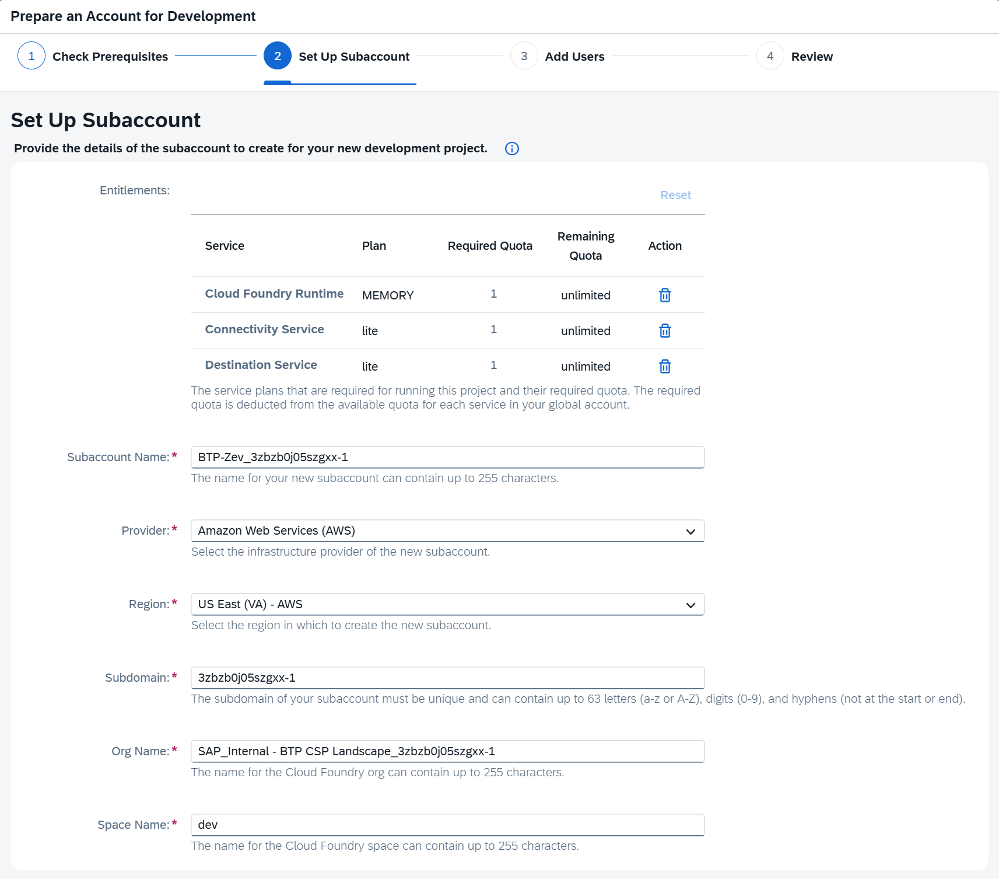
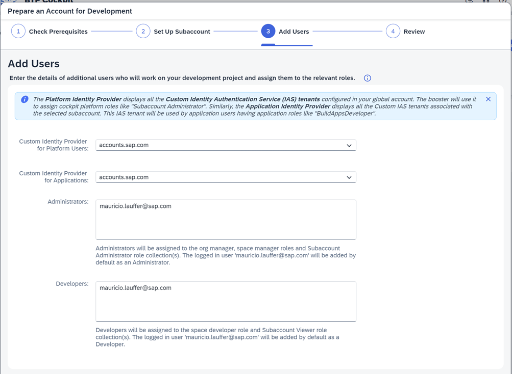
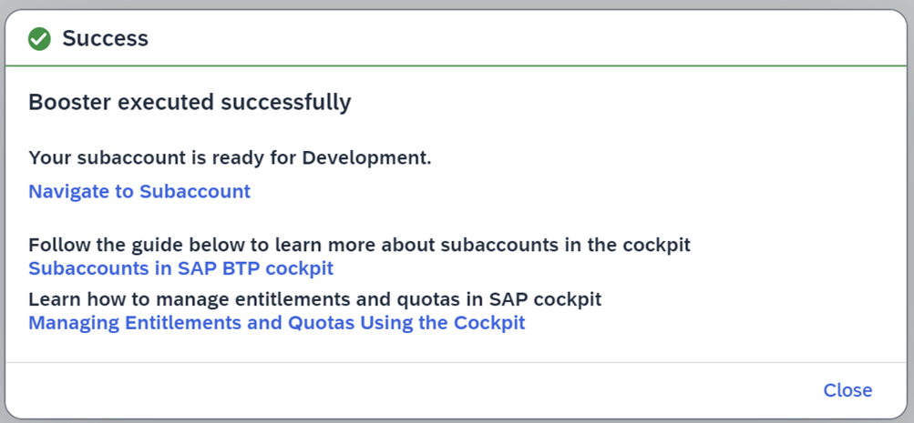

# Cloud Foundry Runtime

Learn how to set up Cloud Foundry runtime in a new SAP BTP subaccount using Boosters.

For more information about the service, see the SAP Help Portal at [SAP BTP Cloud Foundry runtime](https://help.sap.com/docs/cf-runtime/cloud-foundry-runtime).

## Prerequisites

- You have an account on SAP Business Technology Platform. See [Enterprise Accounts](https://help.sap.com/viewer/65de2977205c403bbc107264b8eccf4b/Cloud/en-US/046f127f2a614438b616ccfc575fdb16.html).
- You're an Administrator of your global account and Org Manager of your subaccount on SAP BTP.

### Open the SAP BTP cockpit

To access SAP BTP Cockpit of your enterprise account, choose [https://cockpit.btp.cloud.sap](https://cockpit.btp.cloud.sap).

Depending on your own geo location, this URL will redirect you to the closest regional SAP BTP Cockpit URL.

---

**Manual Setup**: https://help.sap.com/docs/cf-runtime/cloud-foundry-runtime/initial-setup?locale=en-US

**Using Booster**: https://YOUR_SAP_BTP_GLOBAL_ACCOUNT/booster/8499b227-1498-473a-b24a-1f0968f93459

**Subaccount Name**: Give it a meaningful unique name

**Provider**: For this workshop, make sure to select `Amazon Web Services (AWS)`

**Region**: For this workshop, make sure to select `US East (VA) - AWS` (cf-us10)

**Subdomain**: Must be unique

**Org Name**: This is the Cloud Foundry ORG name, the suggested name should be OK, but you can change it

**Space Name**: This is the Cloud Foundry Space name, the suggested name should be OK, but you can change it

