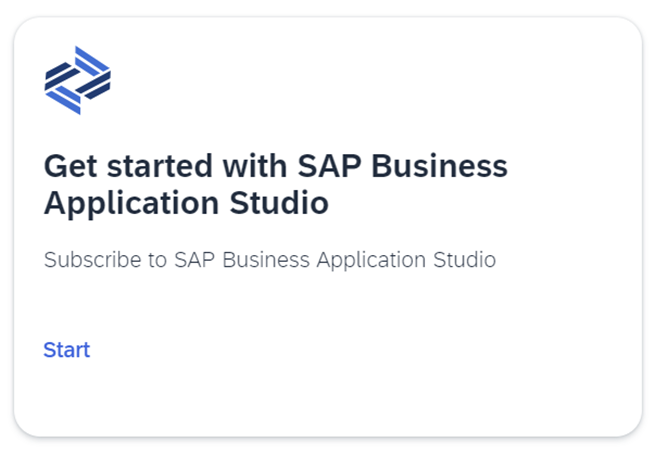
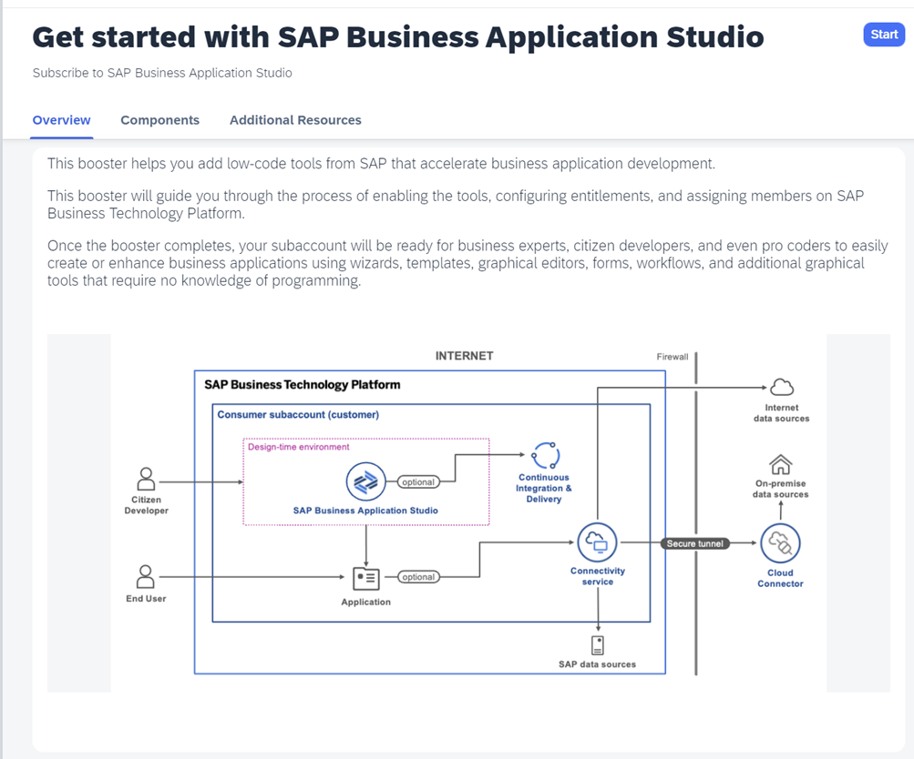
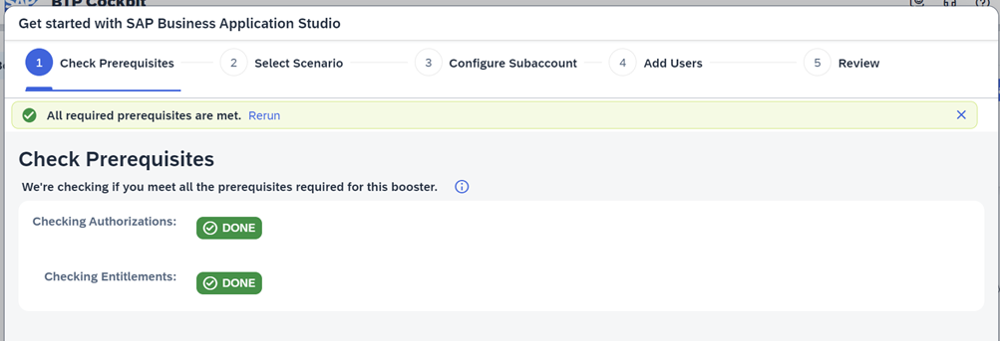
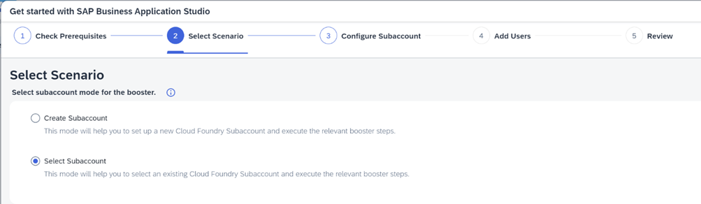
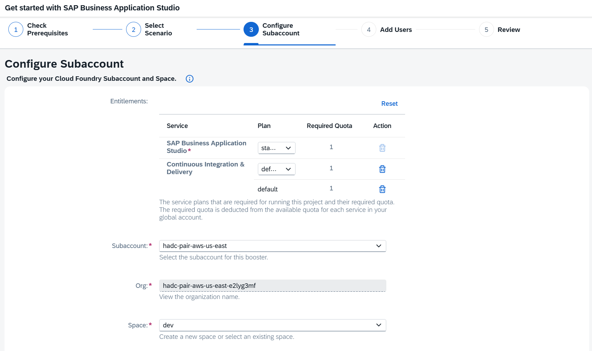
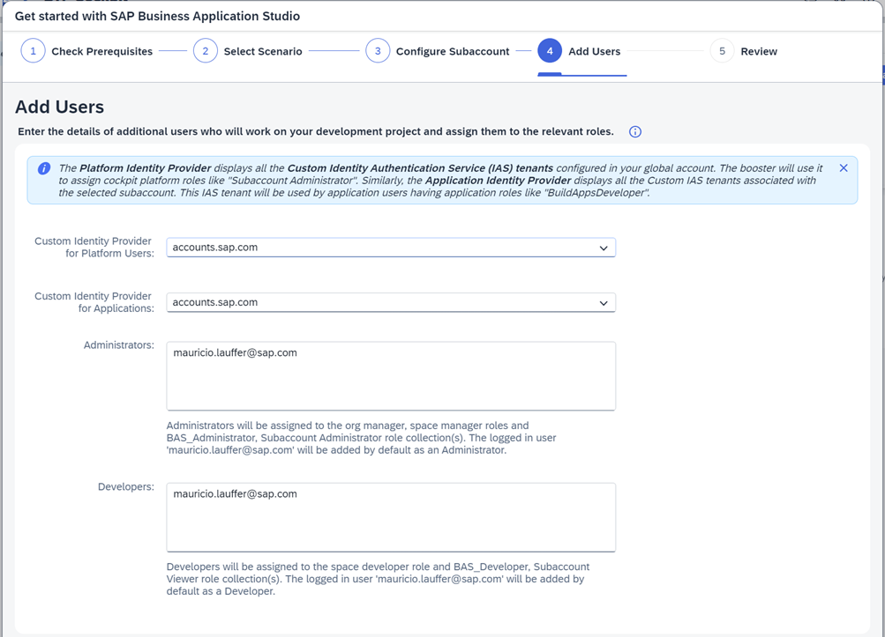
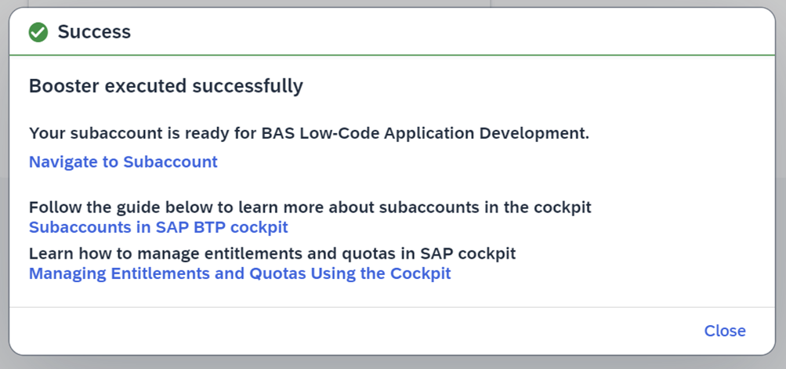

# SAP Business Application Studio

Learn how to set up SAP Business Application Studio in an existing SAP BTP subaccount using Boosters.

For more information about the service, see the SAP Help Portal at [SAP Business Application Studio](https://help.sap.com/docs/bas/sap-business-application-studio).

---

**Manual Setup**: https://help.sap.com/docs/bas/sap-business-application-studio/getting-started

**Using Booster**: https://YOUR_SAP_BTP_GLOBAL_ACCOUNT/booster/bas-ptk

