# Get Started with SAP Cloud Transport Management Service

Learn how to set up SAP Cloud Transport Management Service in an existing SAP BTP subaccount.

For more information about SAP Cloud Transport Management service, see the SAP Help Portal at [SAP Cloud Transport Management Service](https://help.sap.com/docs/cloud-transport-management).

---

### Configure Entitlements to SAP Cloud Transport Management Service

In general, entitlements are required to define access of a subaccount to a service.

1. To display the existing entitlements for SAP Cloud Transport Management, select the **Entitlements** link on your subaccount's overview screen. In a new subaccount (or in a subaccount that hasn't been used for SAP Cloud Transport Management), you will normally not find entitlements for SAP Cloud Transport Manangement.

   

2. To change the entitlement settings, click on **Edit**.

   

3. To add the missing entitlements, click on **Add Service Plans**.

   

4. In the dialog window, search for _Cloud Transport Management_ (for example by entering _trans_). Click on the entry **Cloud Transport Management**. From the **Available Plans**, select:

- **standard**
  - Provides programmatic access to Cloud Transport Management...

- **standard (Application)** or **free (Application)**
  - Manage transports of development artifacts and application-specific content...

Click on **Add 2 Service Plans**.

5. Choose **Save**.

   

See also on SAP Help Portal: [Configuring Entitlements to SAP Cloud Transport Management](https://help.sap.com/docs/TRANSPORT_MANAGEMENT_SERVICE/7f7160ec0d8546c6b3eab72fb5ad6fd8/13894bed9e2d4b25aa34d03d002707f9.html?locale=en-US)

---

### Subscribe to SAP Cloud Transport Management Service

To enable the usage of the user interface of SAP Cloud Transport Management service, subscribe to the Cloud Transport Management application.

1. In your subaccount, go to **Services > Service Marketplace**. Use the _Search_ field to filter for _transport management_. The _Cloud Transport Management_ tile is displayed. Click on it.

   

2. To create a subscription, choose **Create**.

   

3. Select the _free_ subscription plan. If you have access to a paid subscription, this would show as _standard_ in the subscription plan list, in addition to the _standard_ entry in the instance list.

   

4. Click on **Create**.

   

5. The subscription is in progress. Choose **View Subscription**.

   

6. You've subscribed to the _Cloud Transport Management_ application.

   

See also on SAP Help Portal: [Subscribing to Cloud Transport Management](https://help.sap.com/docs/TRANSPORT_MANAGEMENT_SERVICE/7f7160ec0d8546c6b3eab72fb5ad6fd8/7fe10fc1baae444e9315579786d623b9.html?locale=en-US)

---

### Set Up Role Collections

After successful subscription, you need to configure user access to the SAP Cloud Transport Management application. You create different role collections for the different SAP Cloud Transport Management roles, and assign roles to the role collections based on the application templates. Afterwards, you assign the role collections to users or user groups.

1.  Before you can use the user interface of SAP Cloud Transport Management, you'll need to set up role collections and assign roles and permissions to your user, which you will do in this step. To create role collections for the roles that you want to use for the service, choose **Security > Role Collections** from the navigation on the left (1). Filter for role collections called _TMS_ (2). The delivered role collections are displayed. To create a new role collection, choose **Create** (3).

    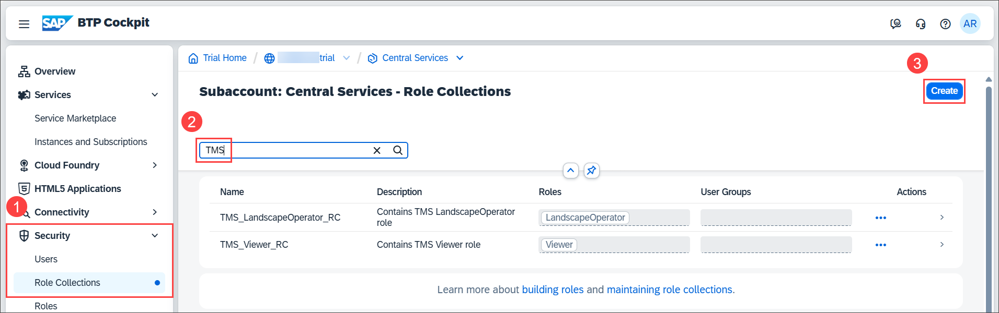

2.  To create a role collection for administrative tasks, enter a name, here `TMS Admin` (1), a description (optional), and choose **Create** (2).

    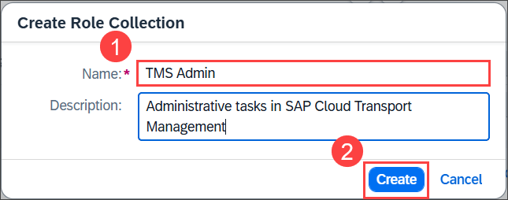

3.  The role collection was created.

    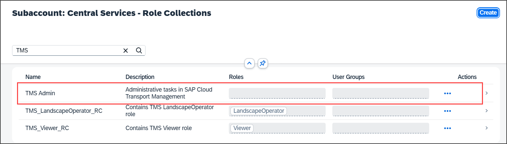

4.  To assign the SAP Cloud Transport Management **Administrator** role to the new role collection, go to the **Roles** tab of the subscription details. To do this, choose **Services > Instances and Subscriptions** from the navigation on the left (1), and select the arrow at the end of the **Cloud Transport Management** row (2).

    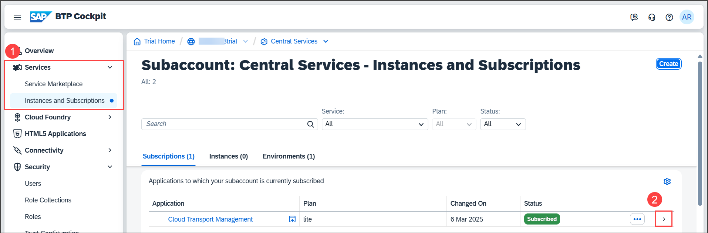

5.  Select the **Roles** tab.

    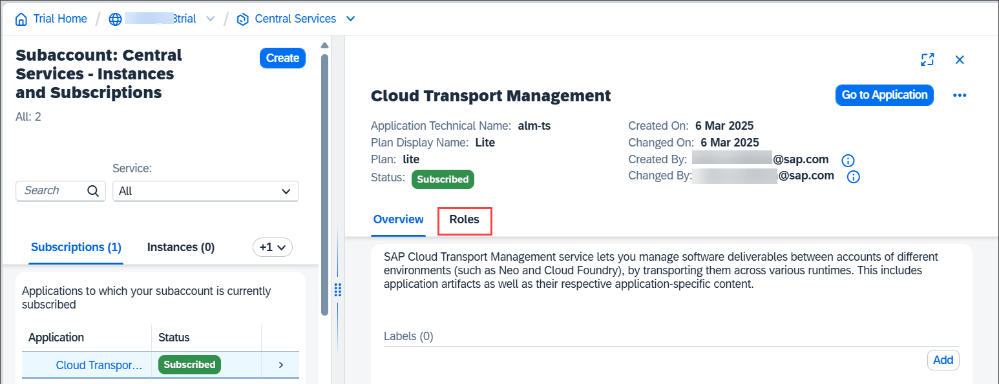

6.  On the **Roles** tab, the default role templates for SAP Cloud Transport Management are displayed. In the row of the **Administrator** role template, choose the **+** button.

    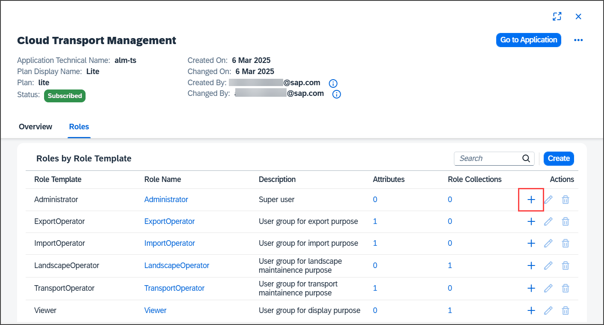

7.  On the **Add to Role Collection** dialog box, select the **TMS Admin** role collection (1), and choose **Add** (2).

    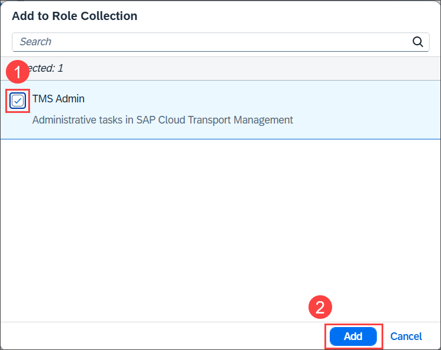

8.  The role collection was added to the **Administrator** role template.

    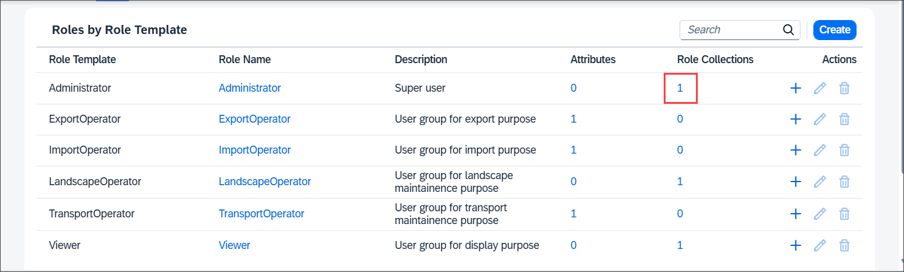

9.  You can now add users to the new role collection. To do this, choose **Security > Role Collections** from the navigation on the left (1). Filter for the _TMS_ role collections (2). Select the arrow at the end of the **TMS Admin** row (3).

    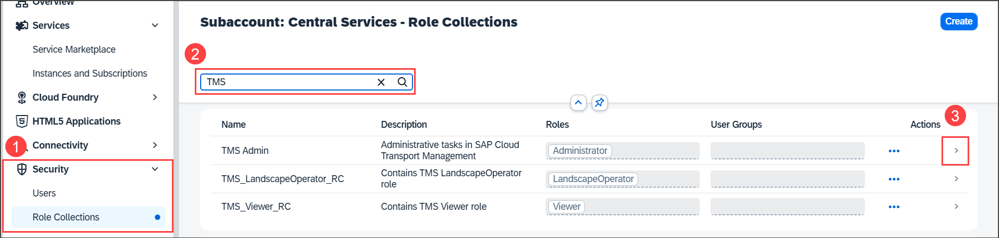

10. In the details of the **TMS Admin** role collection, choose **Edit**.

    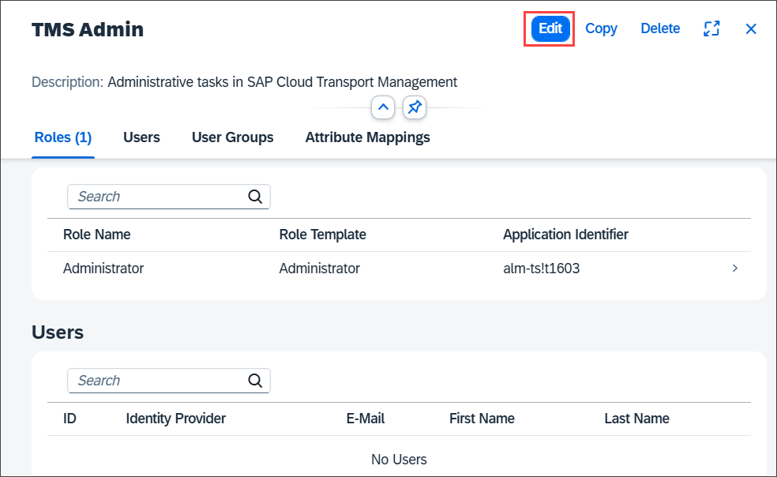

11. You can add individual users or user groups to the role collection. In the tutorial, add an individual user. To do this, select the identity provider (here: **Default identity provider**). In the ID field, enter an existing e-mail address and choose `Enter` (1). The **E-Mail** field is automatically filled with the selected e-mail address. Save your changes (2).

    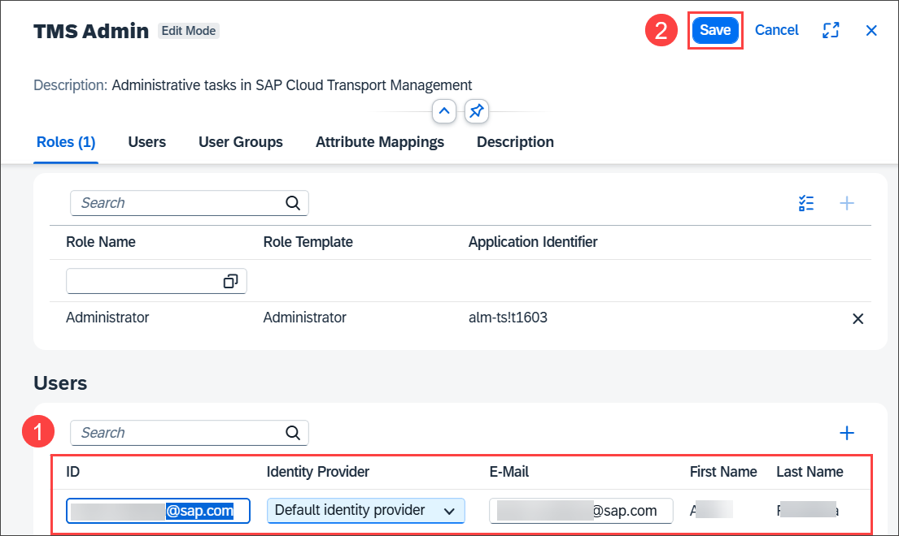

12. The role collection was added to the selected user. You see that **1** user is displayed.

    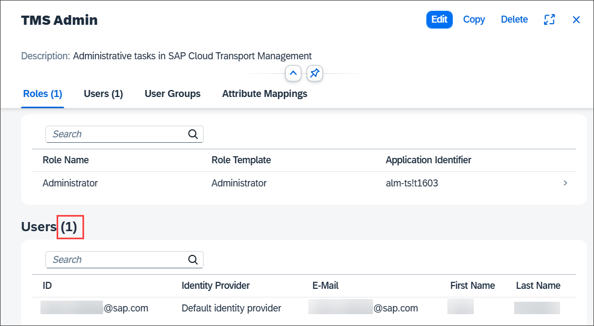

If you want to create other role collections for other tasks, such as the **Import Operator** for import tasks, you can repeat the steps. However, this is not required for the tutorial.

See also on SAP Help Portal: [Setting Up Role Collections](https://help.sap.com/docs/TRANSPORT_MANAGEMENT_SERVICE/7f7160ec0d8546c6b3eab72fb5ad6fd8/eb134e02d2074918bcc5af34f50fb19f.html?locale=en-US)

---

### Create a Service Instance and a Service Key

A service instance is required to enable the usage of SAP Cloud Transport Management service using programmatic access (using API Remote Call), for example if you want to use the service to export content directly in your application. To create a destination to SAP Cloud Transport Management service, you need to provide a service key.

1. In your subaccount, choose **Services > Instances and Subscriptions** (1). Choose **Create** (2).

   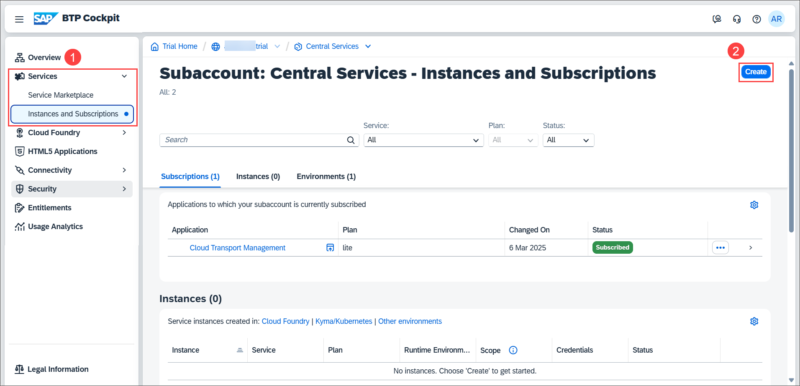

2. From the **Services** dropdown menu, select **Cloud Transport Management** (1). From the **Plan** dropdown menu, select the **standard** plan of the **Instances** type (2).

   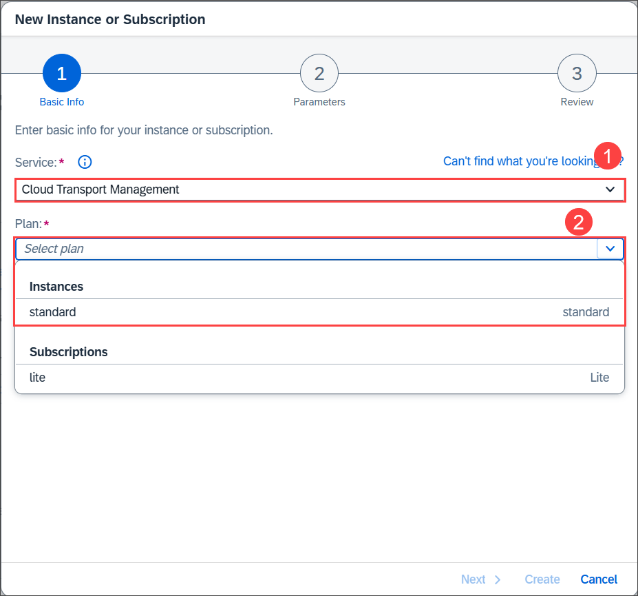

3. Enter an **Instance Name** (1), and choose **Create** (2).

   > You don't have to choose **Next**, because the next step isn't necessary for SAP Cloud Transport Management. It's a default step when creating service instances, allowing you to enter JSON parameters, but SAP Cloud Transport Management doesn't support JSON parameters.

   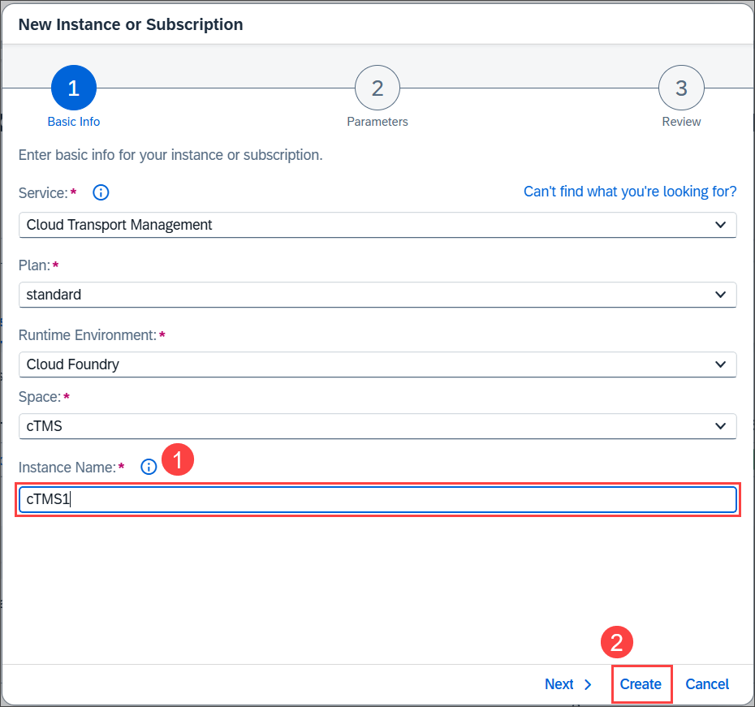

4. The service instance is being created.

   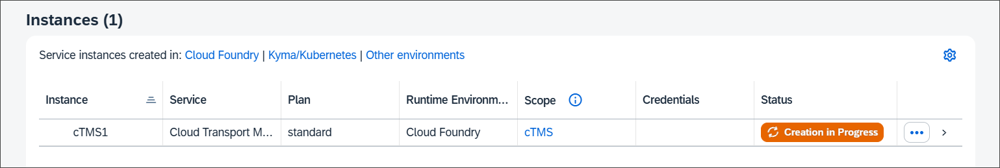

5. When the instance is created, you can create the service key. Select the three dots **(...)** at the end of the row and choose **Create Service Key**.

   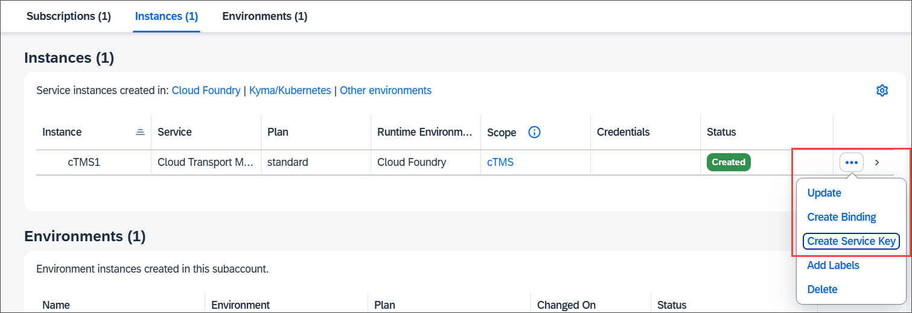

6. On the **New Service Key** dialog, enter a name for the service key (1), here `cTMS1-key`, and choose **Create** (2).

   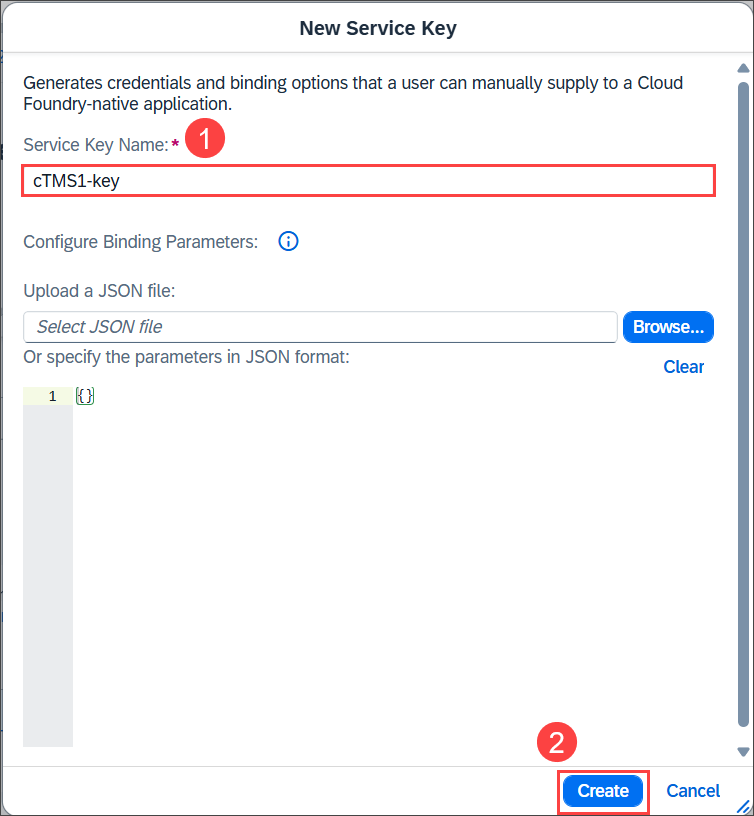

7. The service key is created. To display it, select the three dots **(...)** at the end of the row and choose **View**.

   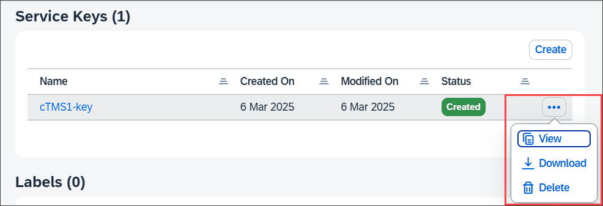

8. The service key looks as follows. For the destination to SAP Cloud Transport Management service, you need, for example, the values of `clientid`, `clientsecret`, and `url` in the `uaa` section.

   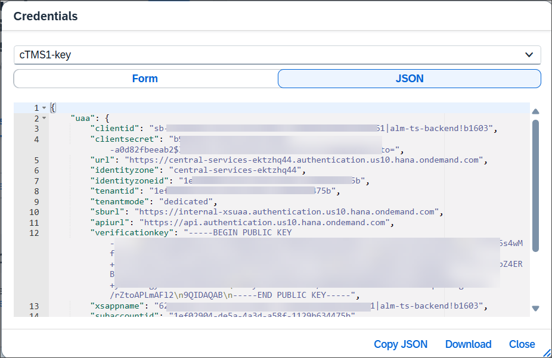

See also on SAP Help Portal: [Creating a Service Instance and a Service Key](https://help.sap.com/docs/TRANSPORT_MANAGEMENT_SERVICE/7f7160ec0d8546c6b3eab72fb5ad6fd8/f44956035ce54684b1dbb9e4d23c37d2.html?locale=en-US)

---

### Verify access to Cloud Transport Management

You should now be able to access the user interface of SAP Cloud Transport Management service.

1. To check this, in your subaccount, choose **Services > Instances and Subscriptions** (1). In the **Subscriptions** section, choose the **Cloud Transport Management** link or the _Go to Application_ icon to the right of it (2).

   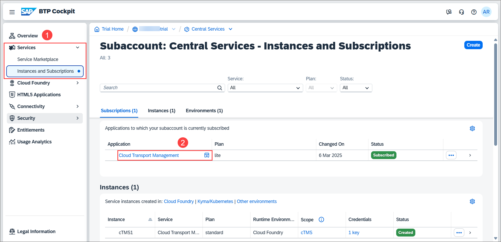

2. In a new tab, you should now see the **Overview** page of your **SAP Cloud Transport Management** service instance. Currently, it looks quite empty which is expected from a new instance.

   

This concludes the tutorial. Congratulations!

For more information, see the [SAP Cloud Transport Management](https://help.sap.com/docs/cloud-transport-management) documentation on SAP Help Portal.
