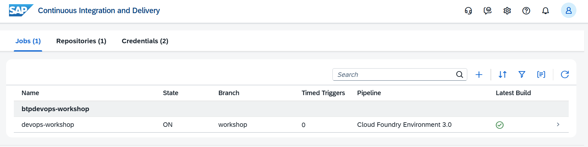
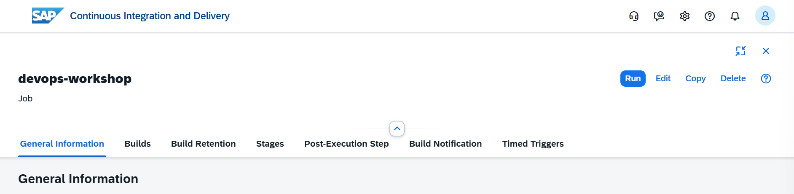
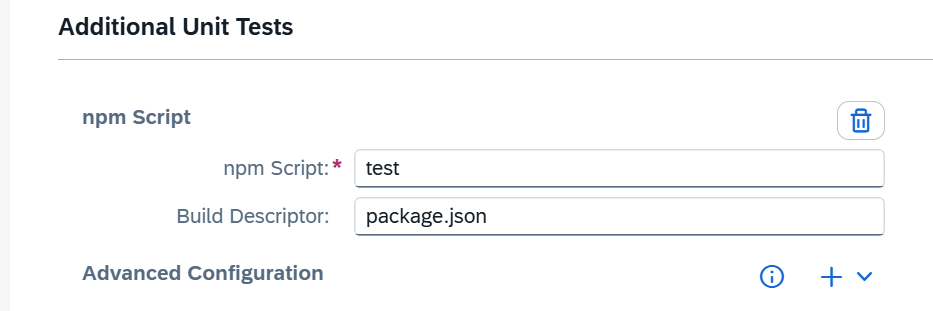

# CAP cds.test

The `cds.test` library provides best practice utils for writing tests for CAP Node.js applications.

You can use the function `cds.test()` to easily launch and test a CAP server. You can test all services programmatically using the respective [Node.js Service APIs](https://cap.cloud.sap/docs/node.js/core-services), or, test all HTTP APIs directly calling the endpoints which better represents real usage of your apps.

To add initial template tests based on the services defined in the project, you can execute $ `cds add test` in the terminal. It will install the required dependencies and create 1 test file per service definition.


A new entry will be added to `scripts` in the `package.json`.

```json
{
  "scripts": {
    ... // other scripts already created
    "test": "node --test"
  },
}
```

Run the new `test` script to execute all the test files available in the project: $ `npm test`

The test run should fail, the errors will be reported in the console. You should see the failing tests, the expected values and a stack trace for the errors.


## SAP Continuous Integration and Delivery Configuration

### Additional Unit Tests

Go back to the `SAP Continuous Integration and Delivery` service. On the `Jobs` tab, select the previously created job.



Then, click on the `Edit` button.



Go to `Stages`, then `Additional Unit Tests` stage. Let's activate `npm Script`.

Click on the `+` (Add) button next to `npm Script`.

Choose `+` (Add) to add an `npm Script`.

In the `npm Script` text field, enter the name of the test script from the `scripts` section to be executed.



Click on the `Save` button.

Now, the automated tests implemented in the project will be executed as part of the CI/CD pipeline.

### Commit the code changes

Back to Business Application Studio, commit the changes made in the project. From the terminal, execute the following commands to commit and push the changes to the git repository.

Add changes from the working directory to the git staging area (or "index"), preparing them to be included in the next commit:

```shell
git add .
```

Record a snapshot of your staged changes to the local repository's history. Each commit acts as a "save point" with a unique ID and a descriptive message:

```shell
git commit -m "test: add tests"
```

Upload local repository content to a remote repository. Pushing is how you transfer commits from your local repository to a remote one:

```shell
git push
```

The changes will be sent to GitHub and it will trigger the CI/CD pipeline configured in SAP BTP.

### CI/CD results

Back to the SAP Continuous Integration and Delivery service, the `Build` process should fail because the `Additional Unit Tests` stage has failed. The failure is due to the automated tests not passing.

The `Build` process will only successfully complete when `linting` doesn't return any errors and the `automated tests` are passing.

Now, you should fix the tests in the codebase, commit them and wait for the CI/CD pipeline to be triggered again.

Once the `Build` process is complete, a new transport requested will be created in the `Cloud Transport Management Service`.

